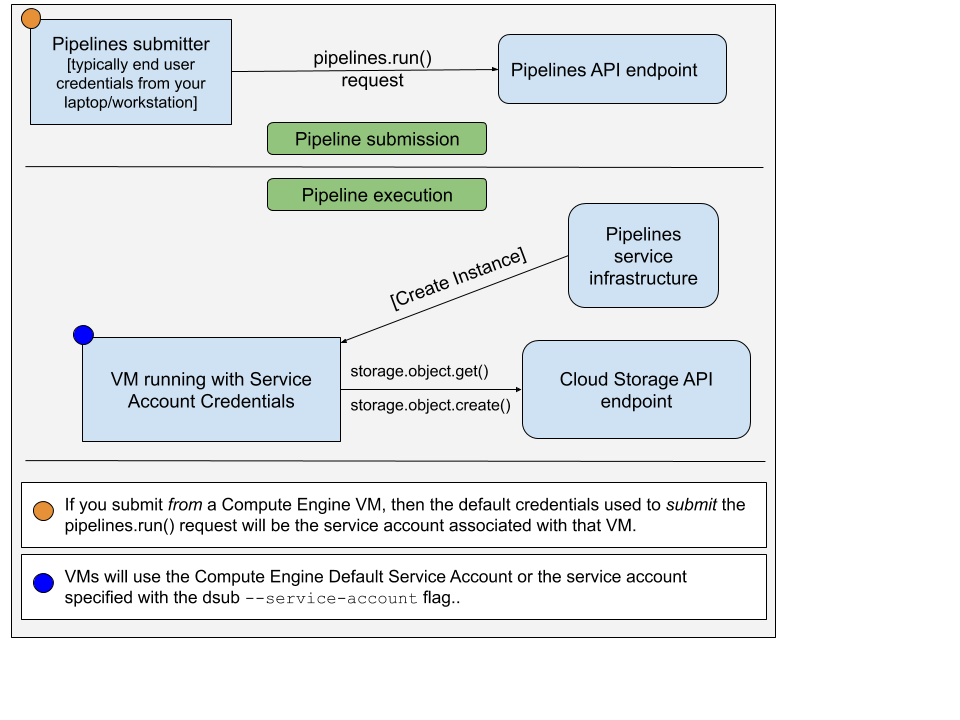

# dsub: simple batch jobs with Docker
[](https://github.com/DataBiosphere/dsub/blob/main/LICENSE)

## Overview

`dsub` is a command-line tool that makes it easy to submit and run batch scripts
in the cloud.

The `dsub` user experience is modeled after traditional high-performance
computing job schedulers like Grid Engine and Slurm. You write a script and
then submit it to a job scheduler from a shell prompt on your local machine.

Today `dsub` supports Google Cloud as the backend batch job runner, along with a
local provider for development and testing. With help from the community, we'd
like to add other backends, such as a Grid Engine, Slurm, Amazon Batch,
and Azure Batch.

## Getting started

`dsub` is written in Python and requires Python 3.7 or higher.

* The last version to support Python 3.6 was `dsub` [0.4.7](https://github.com/DataBiosphere/dsub/releases/tag/v0.4.7).
* For earlier versions of Python 3, use `dsub` [0.4.1](https://github.com/DataBiosphere/dsub/releases/tag/v0.4.1).
* For Python 2, use `dsub` [0.3.10](https://github.com/DataBiosphere/dsub/releases/tag/v0.3.10).

### Pre-installation steps

#### Create a Python virtual environment

This is optional, but whether installing from PyPI or from github,
you are strongly encouraged to use a
[Python virtual environment](https://docs.python.org/3/library/venv.html).

You can do this in a directory of your choosing.

        python3 -m venv dsub_libs
        source dsub_libs/bin/activate

Using a Python virtual environment isolates `dsub` library dependencies from
other Python applications on your system.

Activate this virtual environment in any shell session before running `dsub`.
To deactivate the virtual environment in your shell, run the command:

        deactivate

Alternatively, a set of convenience scripts are provided that activate the
virutalenv before calling `dsub`, `dstat`, and `ddel`. They are in the
[bin](https://github.com/DataBiosphere/dsub/tree/main/bin) directory. You can
use these scripts if you don't want to activate the virtualenv explicitly in
your shell.

#### Install the Google Cloud SDK

While not used directly by `dsub` for the `google-batch` provider, you are likely to want to install the command line tools found in the [Google
Cloud SDK](https://cloud.google.com/sdk/).

If you will be using the `local` provider for faster job development,
you *will* need to install the Google Cloud SDK, which uses `gsutil` to ensure
file operation semantics consistent with the Google `dsub` providers.

1. [Install the Google Cloud SDK](https://cloud.google.com/sdk/)
2. Run

        gcloud init


    `gcloud` will prompt you to set your default project and to grant
    credentials to the Google Cloud SDK.

### Install `dsub`

Choose **one** of the following:

#### Install from PyPI

1.  If necessary, [install pip](https://pip.pypa.io/en/stable/installing/).

1.  Install `dsub`

         pip install dsub

#### Install from github

1.  Be sure you have git installed

    Instructions for your environment can be found on the
    [git website](https://git-scm.com/book/en/v2/Getting-Started-Installing-Git).

1.  Clone this repository.

        git clone https://github.com/DataBiosphere/dsub
        cd dsub

1.  Install dsub (this will also install the dependencies)

        python -m pip install .

1.  Set up Bash tab completion (optional).

        source bash_tab_complete

### Post-installation steps

1.  Minimally verify the installation by running:

        dsub --help

1.  (Optional) [Install Docker](https://docs.docker.com/engine/installation/).

    This is necessary only if you're going to create your own Docker images or
    use the `local` provider.

### Makefile

After cloning the dsub repo, you can also use the
[Makefile](https://github.com/DataBiosphere/dsub/blob/main/Makefile)
by running:

        make

This will create a Python virtual environment and install `dsub` into a
directory named `dsub_libs`.

### Getting started with the local provider

We think you'll find the `local` provider to be very helpful when building
your `dsub` tasks. Instead of submitting a request to run your command on a
cloud VM, the `local` provider runs your `dsub` tasks on your local machine.

The `local` provider is not designed for running at scale. It is designed
to emulate running on a cloud VM such that you can rapidly iterate.
You'll get quicker turnaround times and won't incur cloud charges using it.

1. Run a `dsub` job and wait for completion.

    Here is a very simple "Hello World" test:

        dsub \
          --provider local \
          --logging "${TMPDIR:-/tmp}/dsub-test/logging/" \
          --output OUT="${TMPDIR:-/tmp}/dsub-test/output/out.txt" \
          --command 'echo "Hello World" > "${OUT}"' \
          --wait

    Note: `TMPDIR` is commonly set to `/tmp` by default on most Unix systems,
    although it is also often left unset.
    On some versions of MacOS TMPDIR is set to a location under `/var/folders`.

    Note: The above syntax `${TMPDIR:-/tmp}` is known to be supported by Bash, zsh, ksh.
    The shell will expand `TMPDIR`, but if it is unset, `/tmp` will be used.

1. View the output file.

        cat "${TMPDIR:-/tmp}/dsub-test/output/out.txt"

### Getting started on Google Cloud

`dsub` currently supports the [Batch](https://cloud.google.com/batch/docs/reference/rest)
API from Google Cloud. 

`google-batch` is the current default provider.

The steps for getting started differ slightly as indicated in the steps below:

1.  Sign up for a Google account and
    [create a project](https://console.cloud.google.com/project?).

1.  Enable the APIs:

    - For the `batch` API (provider: `google-batch`):

     [Enable the Batch, Storage, and Compute APIs](https://console.cloud.google.com/flows/enableapi?apiid=batch.googleapis.com,storage.googleapis.com,compute.googleapis.com&redirect=https://console.cloud.google.com).


1. Provide [credentials](https://developers.google.com/identity/protocols/application-default-credentials)
    so `dsub` can call Google APIs:

        gcloud auth application-default login

1.  Create a [Google Cloud Storage](https://cloud.google.com/storage) bucket.

    The dsub logs and output files will be written to a bucket. Create a
    bucket using the [storage browser](https://console.cloud.google.com/storage/browser?project=)
    or run the command-line utility [gsutil](https://cloud.google.com/storage/docs/gsutil),
    included in the Cloud SDK.

        gsutil mb gs://my-bucket

    Change `my-bucket` to a unique name that follows the
    [bucket-naming conventions](https://cloud.google.com/storage/docs/bucket-naming).

    (By default, the bucket will be in the US, but you can change or
    refine the [location](https://cloud.google.com/storage/docs/bucket-locations)
    setting with the `-l` option.)

1.  Run a very simple "Hello World" `dsub` job and wait for completion.

    - For the `batch` API (provider: `google-batch`):

            dsub \
              --provider google-batch \
              --project my-cloud-project \
              --regions us-central1 \
              --logging gs://my-bucket/logging/ \
              --output OUT=gs://my-bucket/output/out.txt \
              --command 'echo "Hello World" > "${OUT}"' \
              --wait

    Change `my-cloud-project` to your Google Cloud project, and `my-bucket` to
    the bucket you created above.

    The output of the script command will be written to the `OUT` file in Cloud
    Storage that you specify.

1. View the output file.

        gsutil cat gs://my-bucket/output/out.txt

## Backend providers

Where possible, `dsub` tries to support users being able to develop and test
locally (for faster iteration) and then progressing to running at scale.

To this end, `dsub` provides multiple "backend providers", each of which
implements a consistent runtime environment. The current providers are:

- local
- google-batch (the default)

More details on the runtime environment implemented by the backend providers
can be found in [dsub backend providers](https://github.com/DataBiosphere/dsub/blob/main/docs/providers/README.md).

### Differences between `google-cls-v2` and `google-batch`

The `google-cls-v2` provider is built on the Cloud Life Sciences `v2beta` API.
This API is very similar to its predecessor, the Genomics `v2alpha1` API.
Details of the differences can be found in the
[Migration Guide](https://cloud.google.com/life-sciences/docs/how-tos/migration).

The `google-batch` provider is built on the Cloud Batch API.
Details of Cloud Life Sciences versus Batch can be found in this
[Migration Guide](https://cloud.google.com/batch/docs/migrate-to-batch-from-cloud-life-sciences).

`dsub` largely hides the differences between the APIs, but there are a
few differences to note:

- `google-batch` requires jobs to run in one region

The `--regions` and `--zones` flags for `dsub` specify where the tasks should
run. The `google-cls-v2` allows you to specify a multi-region like `US`,
multiple regions, or multiple zones across regions.  With the `google-batch`
provider, you must specify either one region or multiple zones within a single
region.

## `dsub` features

The following sections show how to run more complex jobs.

### Defining what code to run

You can provide a shell command directly in the dsub command-line, as in the
hello example above.

You can also save your script to a file, like `hello.sh`. Then you can run:

    dsub \
        ... \
        --script hello.sh

If your script has dependencies that are not stored in your Docker image,
you can transfer them to the local disk. See the instructions below for
working with input and output files and folders.

### Selecting a Docker image

To get started more easily, `dsub` uses a stock Ubuntu Docker image.
This default image may change at any time in future releases, so for
reproducible production workflows, you should always specify the image
explicitly.

You can change the image by passing the `--image` flag.

    dsub \
        ... \
        --image ubuntu:16.04 \
        --script hello.sh

Note: your `--image` must include the
[Bash](https://en.wikipedia.org/wiki/Bash_(Unix_shell)) shell interpreter.

For more information on using the
`--image` flag, see the
[image section in Scripts, Commands, and Docker](https://github.com/DataBiosphere/dsub/blob/main/docs/code.md#--image-docker-image)

### Passing parameters to your script

You can pass environment variables to your script using the `--env` flag.

    dsub \
        ... \
        --env MESSAGE=hello \
        --command 'echo ${MESSAGE}'

The environment variable `MESSAGE` will be assigned the value `hello` when
your Docker container runs.

Your script or command can reference the variable like any other Linux
environment variable, as `${MESSAGE}`.

**Be sure to enclose your command string in single quotes and not double
quotes. If you use double quotes, the command will be expanded in your local
shell before being passed to dsub. For more information on using the
`--command` flag, see [Scripts, Commands, and Docker](https://github.com/DataBiosphere/dsub/blob/main/docs/code.md)**

To set multiple environment variables, you can repeat the flag:

    --env VAR1=value1 \
    --env VAR2=value2

You can also set multiple variables, space-delimited, with a single flag:

    --env VAR1=value1 VAR2=value2

### Working with input and output files and folders

dsub mimics the behavior of a shared file system using cloud storage
bucket paths for input and output files and folders. You specify
the cloud storage bucket path. Paths can be:

* file paths like `gs://my-bucket/my-file`
* folder paths like `gs://my-bucket/my-folder`
* wildcard paths like `gs://my-bucket/my-folder/*`

See the [inputs and outputs](https://github.com/DataBiosphere/dsub/blob/main/docs/input_output.md)
documentation for more details.

### Transferring input files to a Google Cloud Storage bucket.

If your script expects to read local input files that are not already
contained within your Docker image, the files must be available in Google
Cloud Storage.

If your script has dependent files, you can make them available to your script
by:

 * Building a private Docker image with the dependent files and publishing the
   image to a public site, or privately to Google Container Registry or
   Artifact Registry
 * Uploading the files to Google Cloud Storage

To upload the files to Google Cloud Storage, you can use the
[storage browser](https://console.cloud.google.com/storage/browser?project=) or
[gsutil](https://cloud.google.com/storage/docs/gsutil). You can also run on data
that’s public or shared with your service account, an email address that you
can find in the [Google Cloud Console](https://console.cloud.google.com).

#### Files

To specify input and output files, use the `--input` and `--output` flags:

    dsub \
        ... \
        --input INPUT_FILE_1=gs://my-bucket/my-input-file-1 \
        --input INPUT_FILE_2=gs://my-bucket/my-input-file-2 \
        --output OUTPUT_FILE=gs://my-bucket/my-output-file \
        --command 'cat "${INPUT_FILE_1}" "${INPUT_FILE_2}" > "${OUTPUT_FILE}"'

In this example:

- a file will be copied from `gs://my-bucket/my-input-file-1` to a path on the data disk
- the path to the file on the data disk will be set in the environment variable `${INPUT_FILE_1}`
- a file will be copied from `gs://my-bucket/my-input-file-2` to a path on the data disk
- the path to the file on the data disk will be set in the environment variable `${INPUT_FILE_2}`

The `--command` can reference the file paths using the environment variables.

Also in this example:

- a path on the data disk will be set in the environment variable `${OUTPUT_FILE}`
- the output file will written to the data disk at the location given by `${OUTPUT_FILE}`

After the `--command` completes, the output file will be copied to the bucket path `gs://my-bucket/my-output-file`

Multiple `--input`, and `--output` parameters can be specified and
they can be specified in any order.

#### Folders

To copy folders rather than files, use the `--input-recursive` and
`output-recursive` flags:

    dsub \
        ... \
        --input-recursive FOLDER=gs://my-bucket/my-folder \
        --command 'find ${FOLDER} -name "foo*"'

Multiple `--input-recursive`, and `--output-recursive` parameters can be
specified and they can be specified in any order.

#### Mounting "resource data"

While explicitly specifying inputs improves tracking provenance of your data,
there are cases where you might not want to expliclty localize all inputs
from Cloud Storage to your job VM.

For example, if you have:

- a large set of resource files
- your code only reads a subset of those files
- runtime decisions of which files to read

OR

- a large input file over which your code makes a single read pass

OR

- a large input file that your code does not read in its entirety

then you may find it more efficient or convenient to access this data by
mounting read-only:

- a Google Cloud Storage bucket
- a persistent disk that you pre-create and populate
- a persistent disk that gets created from a
[Compute Engine Image](https://cloud.google.com/compute/docs/images) that you
pre-create.

The `google-batch` provider supports these methods of
providing access to resource data.

The `local` provider supports mounting a
local directory in a similar fashion to support your local development.

##### Mounting a Google Cloud Storage bucket

To have the `google-batch` provider mount a
Cloud Storage bucket using
[Cloud Storage FUSE](https://cloud.google.com/storage/docs/gcs-fuse), use the
`--mount` command line flag:

    --mount RESOURCES=gs://mybucket

The bucket will be mounted read-only into the Docker container running your
`--script` or `--command` and the location made available via the environment
variable `${RESOURCES}`. Inside your script, you can reference the mounted path
using the environment variable. Please read
[Key differences from a POSIX file system](https://cloud.google.com/storage/docs/gcs-fuse#notes)
and [Semantics](https://github.com/GoogleCloudPlatform/gcsfuse/blob/master/docs/semantics.md)
before using Cloud Storage FUSE.

##### Mounting an existing peristent disk

To have the `google-batch` provider mount a persistent disk that
you have pre-created and populated, use the `--mount` command line flag and the
url of the source disk:

    --mount RESOURCES="https://www.googleapis.com/compute/v1/projects/your-project/zones/your_disk_zone/disks/your-disk"

##### Mounting a persistent disk, created from an image

To have the `google-batch` provider mount a persistent disk created from an image,
use the `--mount` command line flag and the url of the source image and the size
(in GB) of the disk:

    --mount RESOURCES="https://www.googleapis.com/compute/v1/projects/your-project/global/images/your-image 50"

The image will be used to create a new persistent disk, which will be attached
to a Compute Engine VM. The disk will mounted into the Docker container running
your `--script` or `--command` and the location made available by the
environment variable `${RESOURCES}`. Inside your script, you can reference the
mounted path using the environment variable.

To create an image, see [Creating a custom image](https://cloud.google.com/compute/docs/images/create-delete-deprecate-private-images).

##### Mounting a local directory (`local` provider)

To have the `local` provider mount a directory read-only, use the `--mount`
command line flag and a `file://` prefix:

    --mount RESOURCES=file://path/to/my/dir

The local directory will be mounted into the Docker container running your
`--script`or `--command` and the location made available via the environment
variable `${RESOURCES}`. Inside your script, you can reference the mounted
path using the environment variable.

### Setting resource requirements

`dsub` tasks run using the `local` provider will use the resources available on
your local machine.

`dsub` tasks run using the `google-batch` provider can take advantage
of a wide range of CPU, RAM, disk, and hardware accelerator (eg. GPU) options.

See the [Compute Resources](https://github.com/DataBiosphere/dsub/blob/main/docs/compute_resources.md)
documentation for details.

### Job Identifiers

By default, `dsub` generates a `job-id` with the form
`job-name--userid--timestamp` where the `job-name` is truncated at 10 characters
and the `timestamp` is of the form `YYMMDD-HHMMSS-XX`, unique to hundredths of a
second. If you are submitting multiple jobs concurrently, you may still run into
situations where the `job-id` is not unique. If you require a unique `job-id`
for this situation, you may use the `--unique-job-id` parameter.

If the `--unique-job-id` parameter is set, `job-id` will instead be a unique 32
character UUID created by https://docs.python.org/3/library/uuid.html. Because
some providers require that the `job-id` begin with a letter, `dsub` will
replace any starting digit with a letter in a manner that preserves uniqueness.

### Submitting a batch job

Each of the examples above has demonstrated submitting a single task with
a single set of variables, inputs, and outputs. If you have a batch of inputs
and you want to run the same operation over them, `dsub` allows you
to create a batch job.

Instead of calling `dsub` repeatedly, you can create
a tab-separated values (TSV) file containing the variables,
inputs, and outputs for each task, and then call `dsub` once.
The result will be a single `job-id` with multiple tasks. The tasks will
be scheduled and run independently, but can be
[monitored](https://github.com/DataBiosphere/dsub#viewing-job-status) and
[deleted](https://github.com/DataBiosphere/dsub#deleting-a-job) as a group.

#### Tasks file format

The first line of the TSV file specifies the names and types of the
parameters. For example:

    --env SAMPLE_ID<tab>--input VCF_FILE<tab>--output OUTPUT_PATH

Each addition line in the file should provide the variable, input, and output
values for each task. Each line beyond the header represents the values for a
separate task.

Multiple `--env`, `--input`, and `--output` parameters can be specified and
they can be specified in any order. For example:

    --env SAMPLE<tab>--input A<tab>--input B<tab>--env REFNAME<tab>--output O
    S1<tab>gs://path/A1.txt<tab>gs://path/B1.txt<tab>R1<tab>gs://path/O1.txt
    S2<tab>gs://path/A2.txt<tab>gs://path/B2.txt<tab>R2<tab>gs://path/O2.txt


#### Tasks parameter

Pass the TSV file to dsub using the `--tasks` parameter. This parameter
accepts both the file path and optionally a range of tasks to process.
The file may be read from the local filesystem (on the machine you're calling
`dsub` from), or from a bucket in Google Cloud Storage (file name starts with
"gs://").

For example, suppose `my-tasks.tsv` contains 101 lines: a one-line header and
100 lines of parameters for tasks to run. Then:

    dsub ... --tasks ./my-tasks.tsv

will create a job with 100 tasks, while:

    dsub ... --tasks ./my-tasks.tsv 1-10

will create a job with 10 tasks, one for each of lines 2 through 11.

The task range values can take any of the following forms:

*   `m` indicates to submit task `m` (line m+1)
*   `m-` indicates to submit all tasks starting with task `m`
*   `m-n` indicates to submit all tasks from `m` to `n` (inclusive).

### Logging

The `--logging` flag points to a location for `dsub` task log files. For details
on how to specify your logging path, see [Logging](https://github.com/DataBiosphere/dsub/blob/main/docs/logging.md).

### Job control

It's possible to wait for a job to complete before starting another.
For details, see [job control with dsub](https://github.com/DataBiosphere/dsub/blob/main/docs/job_control.md).

### Retries

It is possible for `dsub` to automatically retry failed tasks.
For details, see [retries with dsub](https://github.com/DataBiosphere/dsub/blob/main/docs/retries.md).

### Labeling jobs and tasks

You can add custom labels to jobs and tasks, which allows you to monitor and
cancel tasks using your own identifiers. In addition, with the Google
providers, labeling a task will label associated compute resources such as
virtual machines and disks.

For more details, see [Checking Status and Troubleshooting Jobs](https://github.com/DataBiosphere/dsub/blob/main/docs/troubleshooting.md)

### Viewing job status

The `dstat` command displays the status of jobs:

    dstat --provider google-batch --project my-cloud-project

With no additional arguments, dstat will display a list of *running* jobs for
the current `USER`.

To display the status of a specific job, use the `--jobs` flag:

    dstat --provider google-batch --project my-cloud-project --jobs job-id

For a batch job, the output will list all *running* tasks.

Each job submitted by dsub is given a set of metadata values that can be
used for job identification and job control. The metadata associated with
each job includes:

*   `job-name`: defaults to the name of your script file or the first word of
    your script command; it can be explicitly set with the `--name` parameter.
*   `user-id`: the `USER` environment variable value.
*   `job-id`: identifier of the job, which can be used in calls to `dstat` and
    `ddel` for job monitoring and canceling respectively. See
    [Job Identifiers](https://github.com/DataBiosphere/dsub#job-identifiers) for more
    details on the `job-id` format.
*   `task-id`: if the job is submitted with the `--tasks` parameter, each task
    gets a sequential value of the form "task-*n*" where *n* is 1-based.

Note that the job metadata values will be modified to conform with the "Label
Restrictions" listed in the [Checking Status and Troubleshooting Jobs](https://github.com/DataBiosphere/dsub/blob/main/docs/troubleshooting.md)
guide.

Metadata can be used to cancel a job or individual tasks within a batch job.

For more details, see [Checking Status and Troubleshooting Jobs](https://github.com/DataBiosphere/dsub/blob/main/docs/troubleshooting.md)

#### Summarizing job status

By default, dstat outputs one line per task. If you're using a batch job with
many tasks then you may benefit from `--summary`.

```
$ dstat --provider google-batch --project my-project --status '*' --summary

Job Name        Status         Task Count
-------------   -------------  -------------
my-job-name     RUNNING        2
my-job-name     SUCCESS        1
```

In this mode, dstat prints one line per (job name, task status) pair. You can
see at a glance how many tasks are finished, how many are still running, and
how many are failed/canceled.

### Deleting a job

The `ddel` command will delete running jobs.

By default, only jobs submitted by the current user will be deleted.
Use the `--users` flag to specify other users, or `'*'` for all users.

To delete a running job:

    ddel --provider google-batch --project my-cloud-project --jobs job-id

If the job is a batch job, all running tasks will be deleted.

To delete specific tasks:

    ddel \
        --provider google-batch \
        --project my-cloud-project \
        --jobs job-id \
        --tasks task-id1 task-id2

To delete all running jobs for the current user:

    ddel --provider google-batch --project my-cloud-project --jobs '*'

## Service Accounts and Scope (Google providers only)

When you run the `dsub` command with the `google-batch`
provider, there are two different sets of credentials to consider:

- Account submitting the `pipelines.run()` request to run your command/script on a VM
- Account accessing Cloud resources (such as files in GCS) when executing your command/script

The account used to submit the `pipelines.run()` request is typically your
end user credentials. You would have set this up by running:

    gcloud auth application-default login

The account used on the VM is a [service account](https://cloud.google.com/iam/docs/service-accounts).
The image below illustrates this:



By default, `dsub` will use the [default Compute Engine service account](https://cloud.google.com/compute/docs/access/service-accounts#default_service_account)
as the authorized service account on the VM instance. You can choose to specify
the email address of another service account using `--service-account`.

By default, `dsub` will grant the following access scopes to the service account:

- https://www.googleapis.com/auth/bigquery
- https://www.googleapis.com/auth/compute
- https://www.googleapis.com/auth/devstorage.full_control
- https://www.googleapis.com/auth/genomics
- https://www.googleapis.com/auth/logging.write
- https://www.googleapis.com/auth/monitoring.write

In addition, [the API](https://cloud.google.com/life-sciences/docs/reference/rest/v2beta/projects.locations.pipelines/run#serviceaccount) will always add this scope:

- https://www.googleapis.com/auth/cloud-platform

You can choose to specify scopes using `--scopes`.

### Recommendations for service accounts

While it is straightforward to use the default service account, this account also
has broad privileges granted to it by default. Following the
[Principle of Least Privilege](https://en.wikipedia.org/wiki/Principle_of_least_privilege)
you may want to create and use a service account that has only sufficient privileges
granted in order to run your `dsub` command/script.

To create a new service account, follow the steps below:

1. Execute the `gcloud iam service-accounts create` command. The email address
of the service account will be `sa-name@project-id.iam.gserviceaccount.com`.

        gcloud iam service-accounts create "sa-name"

2. Grant IAM access on buckets, etc. to the service account.

        gsutil iam ch serviceAccount:sa-name@project-id.iam.gserviceaccount.com:roles/storage.objectAdmin gs://bucket-name

3. Update your `dsub` command to include `--service-account`

        dsub \
          --service-account sa-name@project-id.iam.gserviceaccount.com
          ...

## What next?

*   See the examples:

    *   [Custom scripts](https://github.com/DataBiosphere/dsub/tree/main/examples/custom_scripts)
    *   [Decompress files](https://github.com/DataBiosphere/dsub/tree/main/examples/decompress)
    *   [FastQC](https://github.com/DataBiosphere/dsub/tree/main/examples/fastqc)
    *   [Samtools index](https://github.com/DataBiosphere/dsub/tree/main/examples/samtools)

*   See more documentation for:

    *   [Scripts, Commands, and Docker](https://github.com/DataBiosphere/dsub/blob/main/docs/code.md)
    *   [Input and Output File Handling](https://github.com/DataBiosphere/dsub/blob/main/docs/input_output.md)
    *   [Logging](https://github.com/DataBiosphere/dsub/blob/main/docs/logging.md)
    *   [Compute Resources](https://github.com/DataBiosphere/dsub/blob/main/docs/compute_resources.md)
    *   [Compute Quotas](https://github.com/DataBiosphere/dsub/blob/main/docs/compute_quotas.md)
    *   [Job Control](https://github.com/DataBiosphere/dsub/blob/main/docs/job_control.md)
    *   [Retries](https://github.com/DataBiosphere/dsub/blob/main/docs/retries.md)
    *   [Checking Status and Troubleshooting Jobs](https://github.com/DataBiosphere/dsub/blob/main/docs/troubleshooting.md)
    *   [Backend providers](https://github.com/DataBiosphere/dsub/blob/main/docs/providers/README.md)
